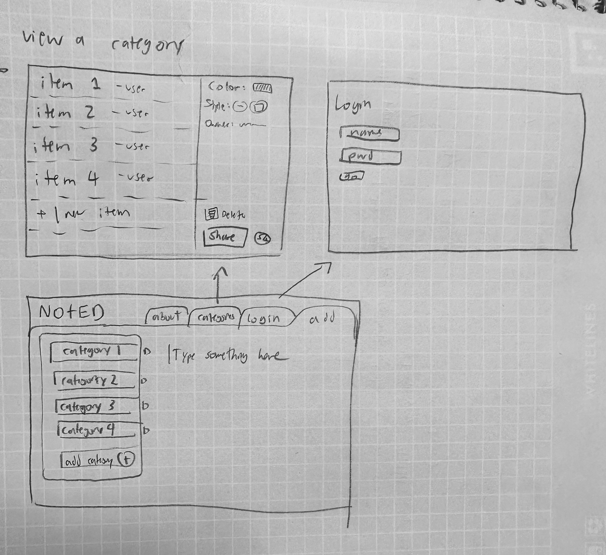

# startup260
## Description deliverable

### Elevator pitch

Have you ever suddenly realized that you needed some ingredient for a meal, some replacement part, some event to look into, then gone to write it down but either forgot it before finding where to write it, or couldn't find where you wrote it down later? Use Noted to note down everything you might forget, and add it immediately to categories of your own making - grocery lists, spare parts, or people to respond to - so your lists don't get lost.

### Design

### Key features

- Secure login over HTTPS
- Ability to select category/categories to add note to
- Display of category choices
- Ability to add category
- Ability to customize added categories
- Ability to view category and all notes added to category
- Ability to delete categories
- Ability to delete items from categories

### Technologies

I am going to use the required technologies in the following ways.

- **HTML** - HTML pages for category viewing, note adding, and login/about page.
- **CSS** - Style options to make them look nice. Make categories look cool.
- **JavaScript** - Login, possibly animate note making.
- **Service** - Backend service with endpoints for:
  - login
  - submit notes
  - view categories
- **DB** - Store categories and notes in categories in database.
- **Login** - Register and login users.
- **WebSocket** - As a user adds a note, it's sent to the web server to be added to a category. When viewing a category, all the corresponding notes are displayed.
- **React** - Application ported to use the React web framework.

## HTML deliverable

For this deliverable I added the application structure.

- **HTML pages** - There are separate pages
- **Links** - There is a navigation menu with links between the pages.
- **Text** - There are text decriptions on the About page and descriptions for different elements.
- **Images** - There is a placeholder logo image on each page in the header.
- **Login** - There is a login page with a place for username/password, and a username display on every page.
- **Database** - There is a mock category viewing page with different notes from a category.
- **WebSocket** - There is a mock category viewing page with different notes from a category, you can select different categories to get the notes from each.

## FROM HERE ON IS UNFINISHED
## CSS deliverable

For this deliverable I properly styled the application into its final appearance.
TEMPLATE
- **Header, footer, and main content body**
- **Navigation elements** - I dropped the underlines and changed the color for anchor elements.
- **Responsive to window resizing** - My app looks great on all window sizes and devices
- **Application elements** - Used good contrast and whitespace
- **Application text content** - Consistent fonts
- **Application images** - Still don't have images and so no styling here. 😔

## JavaScript deliverable

For this deliverable I made my application functional to track and display a user's three votes.
TEMPLATE
- **login** - When you press enter or the login button it takes you to the voting page.
- **database** - Displayed the voting counts. Currently this is stored and retrieved from local storage, but it will be replaced with the database data later.
- **WebSocket** - I used the setInterval function to periodically increase a random vote count. This will be replaced with WebSocket messages later.
- **application logic** - The highlight and ranking number change based up the user's selections.

## Service deliverable

For this deliverable I created an HTTP service to host my frontend and provide backend endpoints.
TEMPLATE
- **Node.js/Express HTTP service** - done!
- **Static middleware for frontend** - done!
- **Calls to third party endpoints** - I didn't have time to implement this. 😔
- **Backend service endpoints** - Placeholders for login that stores the current user on the server. Endpoints for voting.
- **Frontend calls service endpoints** - I did this use the fetch function.

## DB deliverable

For this deliverable I stored and retrieved data from MongoDB.
TEMPLATE
- **MongoDB Atlas database created** - done!
- **Endpoints for data** - My stubbed out endpoints now process the data and send it to Mongo.
- **Stores data in MongoDB** - done!

## Login deliverable

For this deliverable I added user registration and authentication.
TEMPLATE
- **User registration** - Creates a new account in the database.
- **existing user** - Verifies the user's name and password from data stored in the database
- **Use MongoDB to store credentials** - done!
- **Restricts functionality** - You cannot vote until you have logged in.

## WebSocket deliverable

For this deliverable I enabled realtime reporting of votes from other users.
TEMPLATE
- **Backend listens for WebSocket connection** - done!
- **Frontend makes WebSocket connection** - done!
- **Data sent over WebSocket connection** - done!
- **WebSocket data displayed** - All user votes display in realtime

## React deliverable

For this deliverable I port the application over to React.
TEMPLATE
- **Bundled and transpiled** - done!
- **Components** - Login, voting list, vote are all components.
- **Router** - Routing between login and voting components.
- **Hooks** - UseState to track changes in vote state.
